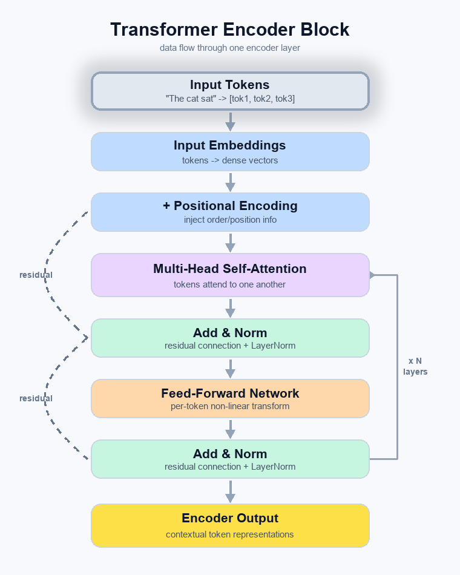
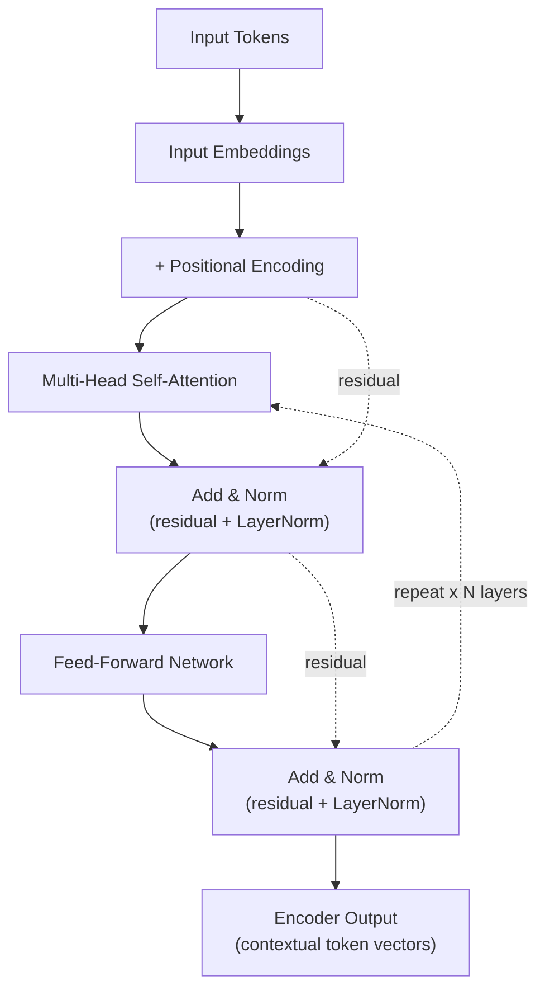

# LLM Fundamentals

A hands-on tutorial on how Large Language Models (LLMs) work under the hood: the Transformer architecture, the vocabulary that shows up in every provider's API (context window, temperature, top-p, top-k), and why even a well-trained model still makes things up.

**What you'll learn:**

- How a Transformer Encoder turns text into contextual vectors, step by step
- Core vocabulary — tokens, context windows, temperature, top-p, top-k — and how they interact
- Why LLMs hallucinate, and what that implies for how you use them
- Where today's major models — GPT-5.x, Claude, Gemini, and the open-weight Llama/Mistral/Qwen families — fit into that picture
- How system/user prompts and API message structures fit together

The Transformer architecture, introduced in the 2017 paper **"Attention Is All You Need,"** is the foundation for most modern LLMs. The full architecture has an Encoder and a Decoder; many popular models use only one half — BERT uses only the Encoder, while GPT-style models use only the Decoder. This tutorial focuses on the Encoder, since it's the more approachable half to build intuition on.

## Transformer-Encoder Architecture

The Encoder's job is to take an input sequence (like a sentence) and turn it into a rich, contextualized numerical representation: a vector for every token that encodes not just what the token is, but how it relates to every other token around it. An Encoder is a stack of identical layers (the original paper used N=6; depth varies by model — BERT-base uses 12). Each layer has two main sub-components: a Multi-Head Self-Attention mechanism and a Position-wise Feed-Forward Network.



Static version, for renderers that don't display GIFs/Mermaid:



A single Encoder layer processes its input in five steps:

1. **Input & Positional Encoding**: The input text is first tokenized and converted into numerical vectors (embeddings). Since the model processes all tokens at once and has no inherent sense of order, **Positional Encodings** are added to these embeddings to give the model information about the position of each token in the sequence.
2. **Multi-Head Self-Attention**: This is the core of the Transformer. It allows each token in the input to "look at" and weigh the importance of all other tokens in the sequence, calculating a new representation for each token as a weighted sum of all other tokens' representations. "Multi-head" means it does this multiple times in parallel with different learned weights, letting the model focus on different aspects of the relationships between tokens at once.
3. **Add & Norm (Residual Connection & Layer Normalization)**: The output of the self-attention layer is added back to its original input (a residual connection), which helps gradients flow during training. This is followed by Layer Normalization to stabilize the network.
4. **Feed-Forward Network**: The normalized output passes through a simple, fully connected feed-forward network, applied to each token's representation independently and identically. It adds further non-linear transformation.
5. **Add & Norm**: Another residual connection and layer normalization are applied to the output of the feed-forward network.

> **Note:** The original paper adds sinusoidal positional encodings directly to the token embeddings, as shown above. Many modern LLMs (e.g., Llama, Mistral) instead use Rotary Position Embeddings (RoPE), applied inside the attention calculation itself — a different mechanism, but the same goal: give the model a sense of token order.

The final output of the top Encoder layer is a sequence of vectors, one per input token, each a rich contextual representation of its token given everything else in the sequence.

## Transformer Intuition

Before using an LLM API effectively, a handful of concepts are worth internalizing — they show up as literal parameter names in every provider's SDK.

### Tokens

LLMs don't see words or characters directly. They process text broken into smaller units called **tokens**. A token can be a whole word, part of a word (subword), or a single character — for example, "tokenization" might be split into "token" and "ization". Exactly how text is split depends on the specific model's tokenizer.

### Context Window

The context window is the maximum number of tokens a model can process at once, including both the input prompt and its generated output — the model's "working memory." If a conversation or document exceeds this limit, older content has to be dropped or summarized to make room.

### Temperature

This parameter controls the randomness of the model's output.

- A **low temperature** (e.g., 0.2) makes the model more deterministic and confident, almost always choosing the highest-probability token — focused, consistent answers.
- A **high temperature** (e.g., 1.0 or higher) increases randomness by flattening the probability distribution, making less-likely tokens more probable. This encourages more diverse or creative output, but also increases the risk of errors.

### Top-p (Nucleus Sampling)

Top-p controls diversity by setting a cumulative probability threshold. The model considers only the smallest set of tokens whose cumulative probability exceeds the `top-p` value. For example, with `top-p=0.9`, the model samples only from the most likely tokens that together make up the top 90% of the probability mass. This is adaptive: if the model is very confident, the candidate set is small; if it's uncertain, the set grows.

### Top-k

Top-k is a simpler way to control diversity: it limits the sampling pool to a fixed number (`k`) of the most likely next tokens. For example, with `k=5`, the model only chooses among the top 5 most probable tokens at each step, ignoring everything else.

**Try it yourself:** send the same prompt twice at `temperature=0` — the outputs should come back nearly identical. Then send it twice at `temperature=1.0` — you should see noticeably different phrasing each time.

### Can We Use Top-p With Temperature and Top-k?

Technically yes — most inference stacks (e.g., Hugging Face's `generate()`, Anthropic's and OpenAI's APIs) accept `temperature`, `top_k`, and `top_p` in the same request, and applying all three is common in practice, not an error. The typical order of operations is:

1. **Temperature** rescales the raw logits, sharpening (low temperature) or flattening (high temperature) the probability distribution.
2. **Top-k** truncates the distribution to the `k` most probable tokens, discarding the rest.
3. **Top-p** then applies nucleus sampling on top of what remains, keeping the smallest set of tokens whose cumulative probability exceeds `p`.
4. The model samples the next token from this final, filtered set.

That said, provider guidance (e.g., OpenAI, Anthropic) generally recommends **adjusting only one of temperature or top-p at a time**, leaving the other at its default — changing both simultaneously makes it hard to reason about why the output changed. Top-k is typically left alone unless you have a specific, advanced use case (e.g., hard-capping the candidate pool for latency or safety reasons); stacking it with top-p is usually redundant rather than harmful.

### Why LLMs Hallucinate

LLM hallucination is the model generating text that sounds plausible and confident but is factually incorrect, nonsensical, or disconnected from the provided context. This happens for several core reasons:

- **They're next-token predictors, not truth-seekers**: An LLM's training objective is to predict the next most statistically probable token, based on patterns learned from a massive dataset. The goal is linguistically coherent text, not verified factual accuracy.
- **No internal "truth" model**: LLMs don't have a database of facts to check against. They don't "know" things the way humans do — they only encode statistical relationships between tokens.
- **Training data imperfections**: Training data can contain biases, inaccuracies, or outdated information, which the model learns and can reproduce.
- **Lossy compression**: Training compresses a vast amount of text into a fixed set of parameters. At generation time the model isn't retrieving stored text verbatim — it's regenerating a statistical approximation, which can blend or drop details, similar to how a person might misremember specifics of something they read long ago.
- **Incentivized guessing**: Standard training procedures often reward a plausible-sounding answer over an honest "I don't know," reinforcing the tendency to guess confidently rather than express uncertainty.

**Key takeaways:**

- Sampling parameters (temperature, top-p, top-k) trade off consistency for diversity — pick based on whether you need reliability (low temperature) or creativity (higher temperature).
- Hallucination isn't a bug you can fully "turn off" with parameters — it's a consequence of how these models are trained. Lowering temperature reduces *randomness*, but doesn't guarantee *correctness*; grounding techniques like retrieval-augmented generation (RAG) and citation-checking address hallucination more directly than sampling settings do.

## 2026 LLM Model Landscape

The concepts above (Transformer layers, tokens, temperature, top-p/top-k) apply to every model below — this section is a snapshot of who's building on top of them as of **July 2026**. This space moves in weeks, not years, so treat the specifics here as a point-in-time reference and check each provider's own release notes for anything newer.

Two broad categories matter for how you'll actually use a model:

- **Closed-weight / API-only**: you call a hosted endpoint; you never get the model's parameters. Usually the most capable, always the most current, billed per token.
- **Open-weight**: the trained parameters are downloadable, so you can self-host, fine-tune, and run offline. "Open-weight" is not the same as "open source" — the weights are public, but the license attached to them (e.g., Meta's Llama Community License) may still restrict how you can use them; Apache 2.0-licensed releases (Mistral, most of Qwen) are the exception, and are open source in the fuller sense.

### Frontier closed-weight models

**OpenAI — GPT-5.x**: GPT-5 launched in mid-2025 and has since shipped as a rapid sequence of point releases rather than infrequent major versions — GPT-5.1 (Nov 2025, adjustable personality), GPT-5.2 (Dec 2025, split into Instant/Thinking/Pro modes), GPT-5.3-Codex (Feb 2026), GPT-5.4 (Mar 2026), GPT-5.5 (Apr 2026), and GPT-5.6 (Jul 2026 — the current model as of this writing). GPT-5.6 ships in three sizes (Sol/Terra/Luna, trading capability for cost), a ~1.05M-token context window, and an explicit `reasoning_effort` control (`none` → `max`) — the same temperature/top-p/top-k sampling you learned above still governs token selection *within* whichever reasoning mode is active.

**Anthropic — Claude Opus 4.8 and Sonnet 4.6**: Anthropic splits its lineup by tier rather than by version number, and updates each tier independently. **Opus 4.8** (May 2026) is the flagship, general-access model, scoring 69.2% on SWE-bench Pro (up from 64.3% for Opus 4.7) and emphasizing agentic reliability — in one honesty eval, it glossed over injected coding failures only 3.7% of the time. **Sonnet 4.6** (Feb 2026) is the mid-tier workhorse: cheaper than Opus ($3/$15 per million tokens), with a 1M-token context window in beta, aimed at everyday coding, computer-use, and agent workloads. Anthropic has since shipped **Sonnet 5** (Jun 2026) as Sonnet 4.6's successor, priced even lower to make long agentic sessions more affordable — a reminder that "the latest Sonnet" and "the latest Opus" don't share a version number, since each tier ships on its own cadence.

**Google DeepMind — Gemini 2.5 and 3**: Gemini 2.5 (Pro and Flash, 2025) introduced "thinking" models with a configurable thinking budget — you trade token spend for reasoning depth explicitly, rather than only via temperature. Gemini 3 (Nov 2025) followed with Pro and DeepThink variants and a 1M-token context window, natively handling text, image, audio, video, and full code repositories in one context. It's since iterated into Gemini 3.1 Pro (Feb 2026, roughly 2x the reasoning benchmark score of Gemini 3 Pro) and Gemini 3.5 Flash (May 2026) for latency-sensitive use.

### Open-weight models

**Meta — Llama 4**: The Llama 4 "herd" (Apr 2025) introduced Meta's first natively multimodal, Mixture-of-Experts Llama models: **Scout** (17B active / 109B total parameters across 16 experts) with an industry-leading 10M-token context window via a new positional scheme (iRoPE), and **Maverick** (17B active across 128 experts) with a 1M-token window. Retrieval accuracy at Scout's full 10M-token limit drops to around 89% (from ~95% at 8M), a useful reminder that a model's *advertised* context window and its *effective* one aren't always the same thing. Released under Meta's own Llama Community License, not a standard open-source license.

**Mistral AI — Mistral Large 3**: A 675B-parameter sparse Mixture-of-Experts model (41B active per token) released Dec 2025 under a genuine Apache 2.0 license — 256K-token context, text and image input, and competitive benchmark scores (~73% MMLU-Pro, ~93.6% MATH-500) for a model you can fully self-host.

**Alibaba — Qwen 3**: Qwen3 (Apr 2025) shipped as a full size range — from a 0.6B dense model up to the 235B-parameter (22B active) Qwen3-235B-A22B MoE flagship — all under Apache 2.0, all with a toggleable "thinking" mode you can switch on for harder reasoning tasks and off for fast, cheap responses, and native context of 128K tokens (extendable further). Through 2026 the family split in two directions: point releases like Qwen3.5 and Qwen3.6 have stayed open-weight under Apache 2.0, while the newest flagships (Qwen3.7-Max, Qwen3.8) moved to closed, API-only access — mirroring the same "open workhorse / closed frontier" split Mistral and Meta haven't made, at least not yet.

| Model | Maker | Weights | Context window | Notable strength |
| --- | --- | --- | --- | --- |
| GPT-5.6 | OpenAI | Closed (API only) | ~1.05M tokens | Configurable reasoning effort, agentic coding |
| Claude Opus 4.8 | Anthropic | Closed (API only) | 200K+ tokens | Hardest agentic/software-engineering tasks |
| Claude Sonnet 4.6 / 5 | Anthropic | Closed (API only) | up to 1M tokens (beta) | Cost-efficient default for coding & agents |
| Gemini 3 / 3.1 | Google DeepMind | Closed (API only) | 1M tokens | Native multimodality, configurable "thinking" |
| Llama 4 (Scout / Maverick) | Meta | Open-weight (custom license) | 10M / 1M tokens | Longest context window, self-hosting |
| Mistral Large 3 | Mistral AI | Open-weight (Apache 2.0) | 256K tokens | Self-hosted frontier-class reasoning |
| Qwen 3 family | Alibaba | Mostly open-weight (Apache 2.0)* | 128K tokens (extendable) | Widest size range, hybrid thinking mode |

\* Newest Qwen flagships (3.7-Max, 3.8) are closed-weight; smaller/point releases remain open.

**Key takeaways:**

- The closed-vs-open split isn't just philosophical — it determines whether you can self-host, fine-tune, or audit a model at all, independent of how capable it is.
- "Context window" numbers are marketing ceilings; effective usable context (retrieval accuracy at the edge of that window) is usually smaller, as Llama 4 Scout's own benchmarks show.
- Every model in this table still ultimately runs a Transformer forward pass and samples its next token with some form of temperature/top-p/top-k — the concepts in this tutorial transfer directly, regardless of which vendor you pick.

## Prompting Types

Now that you know how the model processes text internally and how sampling parameters shape its output, here's how you actually talk to it.

**System Prompt**: A system prompt is a set of instructions that guide the behavior of an LLM. It provides context and instructions for how the LLM should understand and respond to the user's input — what task it's performing and what tone it should use.

```python
system_prompt = """
You are an assistant that analyzes the contents of a website,
and provides a short summary, ignoring text that might be navigation related.
Respond in markdown.
"""
```

**User Prompt**: A user prompt is the question or request the LLM is asked to answer — the input the LLM is given to generate a response, like a conversation starter it should reply to.

```python
user_prompt = """
Here are the contents of a website.
Provide a short summary of this website in markdown.
If it includes news or announcements, then summarize these too.
"""
```

**Response**: The response is the output the LLM generates based on the system prompt and user prompt — the answer to the user's question or request.

The OpenAI API expects messages in a particular structure, and many other providers' APIs share this structure:

```python
[ # List of dictionaries with "role" and "content" keys
    {"role": "system", "content": "system message goes here"},
    {"role": "user", "content": "user message goes here"}
]
```

## Summary

- A Transformer Encoder layer: embed → add position info → self-attend → add & norm → feed-forward → add & norm, repeated across N layers.
- Tokens are the model's unit of text; the context window is how many of them it can hold in view at once.
- Temperature, top-p, and top-k all shape how the next token is sampled — they can be combined, but changing more than one at a time makes behavior harder to reason about.
- Hallucination is structural, not incidental: these models are trained to produce plausible text, not verified facts.
- As of July 2026, the frontier is split between closed-weight API models (GPT-5.x, Claude, Gemini) and open-weight families (Llama 4, Mistral, Qwen) — the choice affects self-hosting and fine-tuning rights, not whether the underlying Transformer math applies.
- A prompt to an LLM API is just a list of role-tagged messages (`system`, `user`, and the model's own `assistant`/`response` turns).

**Where to go next:** this tutorial covered the Encoder half of the Transformer. GPT-style models are Decoder-only and use *causal* (masked) self-attention, so each token can only attend to tokens before it — that's the architecture worth exploring next if you want to understand how text-generation models like GPT actually produce output one token at a time.
